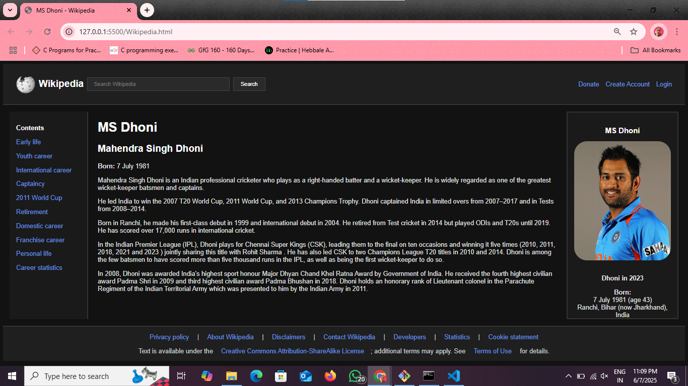

# 🧾 Simple Wikipedia Page (HTML & CSS)

This project is a basic clone of a Wikipedia-style webpage created using **only HTML and CSS**. It demonstrates the structure, styling, and layout similar to a real Wikipedia article, focused on a single topic - MS Dhoni.

---

## 📄 Features

- Header with logo and search bar  
- Sidebar for navigation links (like Contents)  
- Main content area styled like a Wikipedia article  
- Footer with basic info  
- Fully responsive layout (optional if included)

---

## 🛠️ Technologies Used

- **HTML** for content and structure  
- **CSS** for layout and styling  

---

## 📸 Screenshots
  

